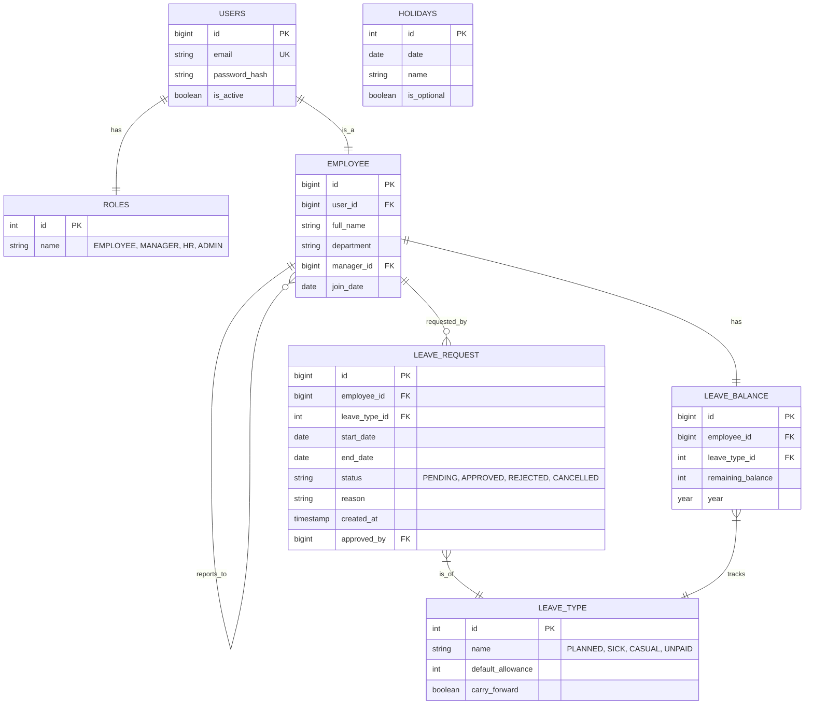

# ELMS Database Design

## Entity Relationship Diagram

```mermaid
erDiagram
    USERS ||--|| ROLES : has
    USERS ||--|| EMPLOYEE : is_a
    EMPLOYEE ||--o{ EMPLOYEE : reports_to
    EMPLOYEE ||--|| LEAVE_BALANCE : has
    EMPLOYEE ||--o{ LEAVE_REQUEST : requested_by
    LEAVE_REQUEST }|--|| LEAVE_TYPE : is_of
    LEAVE_BALANCE }|--|| LEAVE_TYPE : tracks

    USERS {
        bigint id PK
        string email UK
        string password_hash
        boolean is_active
    }

    ROLES {
        int id PK
        string name "EMPLOYEE, MANAGER, HR, ADMIN"
    }

    EMPLOYEE {
        bigint id PK
        bigint user_id FK
        string full_name
        string department
        bigint manager_id FK
        date join_date
    }

    LEAVE_TYPE {
        int id PK
        string name "PLANNED, SICK, CASUAL, UNPAID"
        int default_allowance
        boolean carry_forward
    }

    LEAVE_BALANCE {
        bigint id PK
        bigint employee_id FK
        int leave_type_id FK
        int remaining_balance
        year year
    }

    LEAVE_REQUEST {
        bigint id PK
        bigint employee_id FK
        int leave_type_id FK
        date start_date
        date end_date
        string status "PENDING, APPROVED, REJECTED, CANCELLED"
        string reason
        timestamp created_at
        bigint approved_by FK
    }

    HOLIDAYS {
        int id PK
        date date
        string name
        boolean is_optional
    }
```
